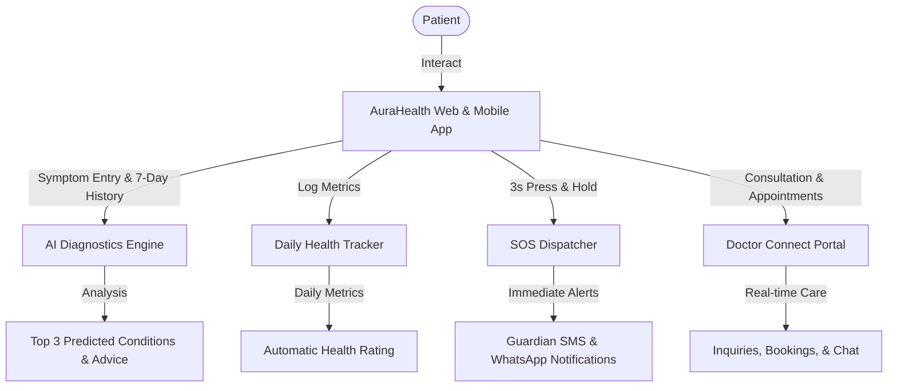
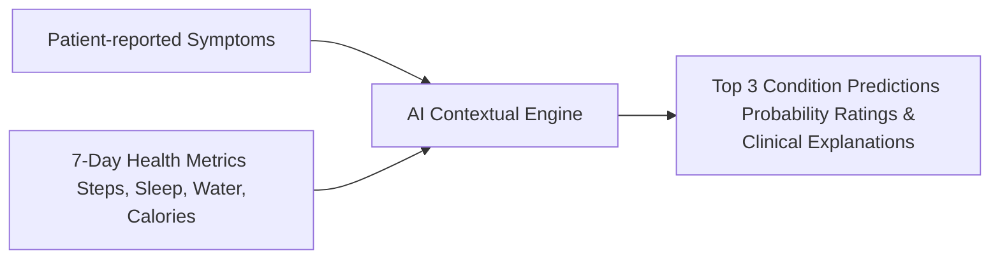
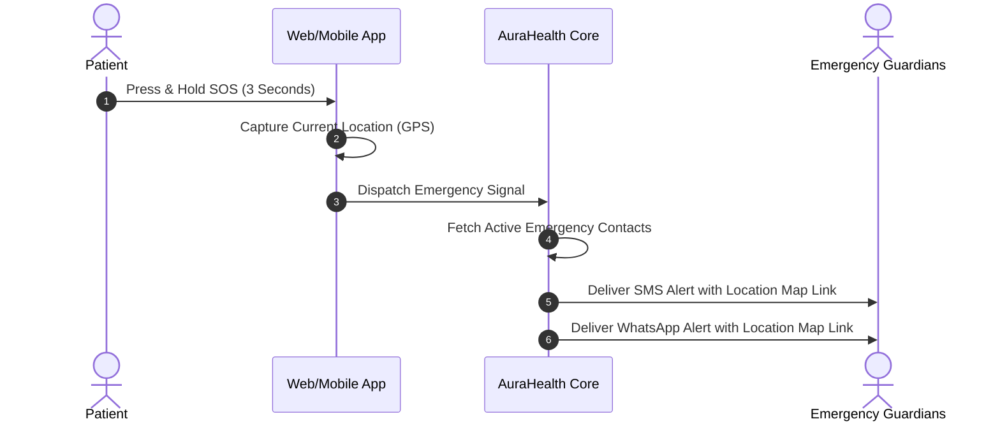

# 🧠 AuraHealth: AI Disease Predictor & Telehealth Platform

AuraHealth is an intelligent, patient-centric telehealth platform designed to bridge the gap between AI-driven wellness diagnostics, real-time health tracking, and professional clinical care. 

---

## 🗺️ System Overview

Here is how patients, healthcare providers, and intelligence services interact within the AuraHealth ecosystem:

---

## 🌟 Key Product Features

### 1. 🔍 AI Symptom Diagnostics & Analysis
AuraHealth does not just look at isolated symptoms. It combines raw clinical input with the patient's lifestyle context to provide a comprehensive wellness prediction.

*   **Behavioral Context Integration**: Automatically pulls the last 7 days of your health metrics (water intake, sleep quality, daily steps, and calories burned) to evaluate whether lifestyle factors might be causing or exacerbating your symptoms.
*   **Structured Recommendations**: Provides clear, conversational advice on next steps, lifestyle changes, and warning signs that require a physician's visit.

---

### 2. 🚨 Automated Emergency SOS Response
When every second counts, AuraHealth provides a simple, foolproof way to get help. 

*   **Press & Hold Safety Trigger**: Features a 3-second safety circle animation to prevent accidental triggers.
*   **Geolocated Notifications**: Automatically gathers coordinates to create a direct Google Maps navigation link.
*   **Dual-Channel Dispatch**: Distributes urgent alerts simultaneously through SMS and WhatsApp to ensure your active guardians receive them immediately.

---

### 3. 🩺 Patient-Doctor Teleconnect Portal
A fully integrated communication loop between patients and healthcare professionals.

*   **For Patients**:
    *   Browse verified doctors by specialty.
    *   Book appointments, track consultation status, and leave ratings/reviews.
    *   Inquire with doctors directly and message them in real-time.
*   **For Doctors**:
    *   Personalized dashboard showing upcoming schedules.
    *   Review patient medical logs, prescription histories, and daily health tracking sheets.
    *   Manage patient inquiries and provide live messaging support.

---

### 4. 📊 Health Metrics & Automatic Scoring
An easy-to-use logging system designed to help users establish healthy habits.

*   **Actionable Metrics**: Log daily steps, sleep duration, water consumption, and calorie expenditure.
*   **Automatic Health Grading**: A background engine analyzes daily progress and assigns an overall wellness rating: **Poor**, **Fair**, **Good**, or **Excellent** to keep you motivated.

---

### 5. 💊 Pill Reminders & Stock Tracker
Never miss a dose or run out of important prescriptions.

*   **Interactive Log**: Log medication intake status (taken vs. skipped) at scheduled times.
*   **Smart Refill Reminders**: Monitors current stock counts and automatically alerts you when medication levels are running low.

---

## 📸 Interface Preview

